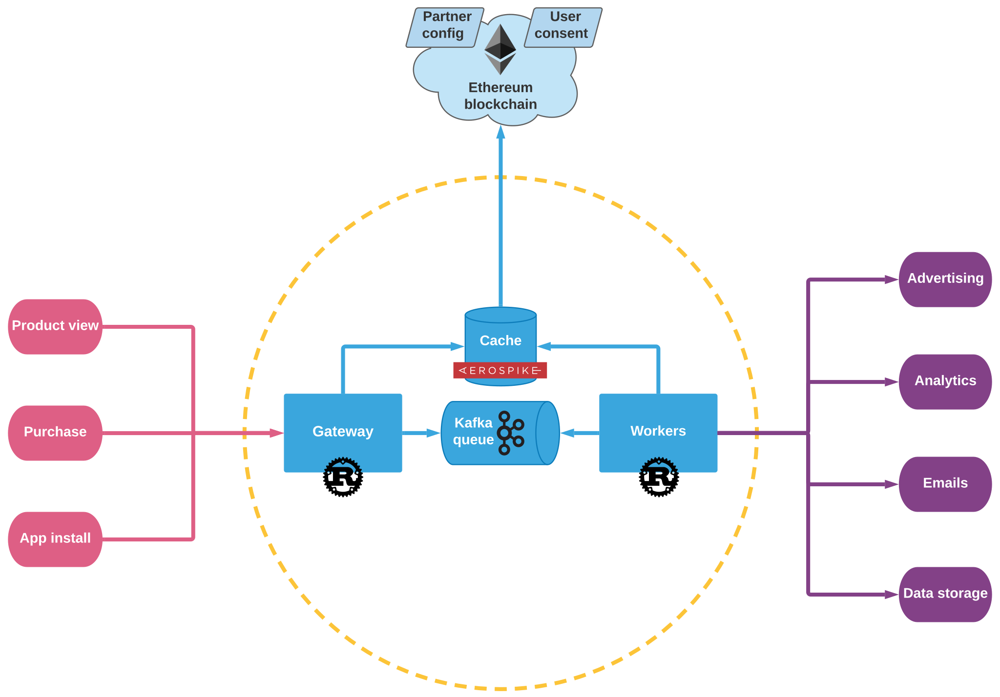

# ucdp

> **Customer Data Platform with undisputable data integrity and user privacy**

[](https://github.com/1r3n33/ucdp/actions/workflows/ucdp.yml)



## Build with docker-compose

```console
$ sudo docker-compose build --no-cache --pull
```

## Run with docker-compose

```console
$ sudo docker-compose up
```

## Send an event request to ucdp

```console
$ curl \
  'http://0.0.0.0:8080/v1/events' \
  -H 'accept: application/json' \
  -H 'Content-Type: application/json' \
  -d '{
        "partner": "0x0000000000000000000000000000000000000123",
        "user": {
          "id": "0x0000000000000000000000000000000000000456"
        },
        "events": [
          {
            "name": "test"
          }
        ]
    }' \
  -v | jq .
```
